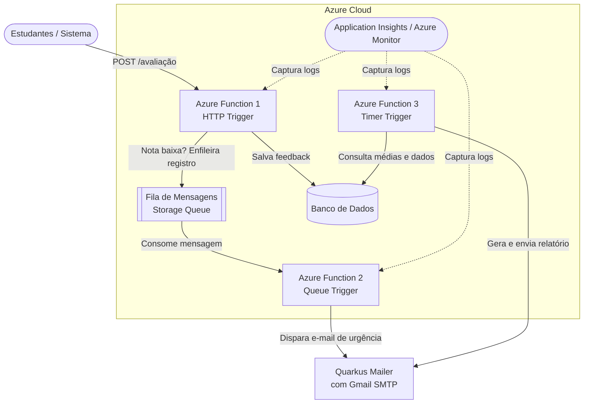

# ChefApi - Plataforma de Feedback e Avaliações

**ARQUITETURA E DESENVOLVIMENTO EM JAVA**
**FIAP - 10ADJT: Fase 4 - Serverless Strategist - Tech Challenge**
**Projeto: ChefApi - Grupo 32**

## 📚 Documentação Completa

- 🇧🇷 **[Documentação em Português](./README_PT.md)** - Guia completo em português

---

## 🏗️ Visão Geral da Arquitetura



---

## ⚡ Quick Start

### Pré-requisitos

- Java 21+
- Maven 3.8+
- PostgreSQL 14+
- Account Azure (gratuita)

### Setup Local

```bash
# Clone o repositório
git clone https://github.com/seu-usuario/chefapi.git
cd avaliacoes

# Configure variáveis de ambiente
cp local.settings.json.example local.settings.json
# Edite local.settings.json com suas credenciais

# Instale dependências
mvnw clean install

# Execute em desenvolvimento
mvnw quarkus:dev
```

Acesse: `http://localhost:8080/avaliacao`

---

## 🎯 Resumo Executivo


| Aspecto             | Detalhes                                        |
| ------------------- | ----------------------------------------------- |
| **Projeto**         | ChefApi - Plataforma serverless de feedback     |
| **Arquitetura**     | Serverless (FaaS) + PaaS + DBaaS no Azure       |
| **Funções**       | 3 Azure Functions (HTTP, Queue, Timer triggers) |
| **Banco de Dados**  | Azure PostgreSQL Flexible Server                |
| **Mensageria**      | Azure Storage Queue                             |
| **Observabilidade** | Azure Application Insights + Monitor            |
| **Linguagem**       | Java 21 + Quarkus 3.35.2                        |
| **Deploy**          | GitHub Actions CI/CD                            |
| **Segurança**      | HTTPS + Criptografia + IAM + OIDC               |

---

## 📋 Equipe


| Nome                            | RM       | Função      |
| ------------------------------- | -------- | ------------- |
| João Gabriel da Silva Medeiros | RM368599 | Desenvolvedor |
| Lucas Eduardo Correa de Souza   | RM367471 | Desenvolvedor |
| Mateus Barbeiro Garcia          | RM368126 | Desenvolvedor |
| Levi Santos                     | RM369031 | Desenvolvedor |

---

## 🚀 Componentes Principais

### 1️⃣ Função de Ingestão de Feedbacks

- **Trigger**: HTTP Trigger
- **Rota**: `POST /avaliacao`
- **Responsabilidade**: Receber, validar e persistir feedbacks
- **Ação Crítica**: Se nota < 5, enfileira para notificação urgente

### 2️⃣ Função de Notificação de Urgência

- **Trigger**: Queue Trigger
- **Responsabilidade**: Consumir fila e enviar e-mails de alerta
- **Integração**: Gmail SMTP (Quarkus Mailer)

### 3️⃣ Função de Relatório Semanal

- **Trigger**: Timer Trigger (CRON)
- **Frequência**: Semanalmente
- **Responsabilidade**: Agregar dados e enviar relatório consolidado

---

## 💾 Configuração Rápida

### Variáveis de Ambiente Obrigatórias

```properties
# PostgreSQL
DB_URL=jdbc:postgresql://host:5432/database
DB_USER=user
DB_PASSWORD=password

# Azure Storage
AzureWebJobsStorage=DefaultEndpointsProtocol=https;...

# Gmail SMTP
EMAIL_USERNAME=seu-email@gmail.com
GMAIL_APP_PASSWORD=xxx xxxx xxxx xxxx
ADMIN_EMAIL=admin@dominio.com

# Application Insights
APPLICATIONINSIGHTS_CONNECTION_STRING=...
```

---

## 🔐 Segurança

✅ **Acesso**: OIDC Federated + Service Principal
✅ **Dados em Trânsito**: HTTPS obrigatório
✅ **Dados em Repouso**: Criptografia nativa PostgreSQL
✅ **Segredos**: Nunca hardcoded (variáveis ambientais)
✅ **Auditoria**: Application Insights centralizado

---

## 📦 Deploy

### Automático (GitHub Actions)

```bash
# Push na branch main ativa o workflow
git add .
git commit -m "feat: nova funcionalidade"
git push origin main
```

### Manual (Azure CLI)

```bash
az login
az functionapp deployment source config-zip \
  -g resource-group-east-us \
  -n avaliacoes-func \
  --src target/avaliacoes-1.0.0-SNAPSHOT-runner.jar
```

---

## 📊 Monitoramento

Acesse **Azure Application Insights**:

- ✅ Live Metrics (fluxo em tempo real)
- ✅ Application Map (dependências)
- ✅ Performance (latência)
- ✅ Failures (rastreamento de erros)
- ✅ Logs customizados (KQL)

---

## 🧪 Testar API

```bash
# Avaliação Normal
curl -X POST http://localhost:8080/avaliacao \
  -H "Content-Type: application/json" \
  -d '{
    "estudante_id":"E001",
    "disciplina":"Quarkus",
    "nota":8,
    "comentario":"Excelente"
  }'

# Avaliação Crítica (nota < 5)
curl -X POST http://localhost:8080/avaliacao \
  -H "Content-Type: application/json" \
  -d '{
    "estudante_id":"E002",
    "disciplina":"Azure",
    "nota":2,
    "comentario":"Confuso"
  }'
```

---

## 📚 Referências

- 📖 [Quarkus Framework](https://quarkus.io)
- ☁️ [Azure Functions](https://learn.microsoft.com/pt-br/azure/azure-functions/)
- 🗄️ [Azure PostgreSQL](https://learn.microsoft.com/pt-br/azure/postgresql/flexible-server/)
- 📈 [Application Insights](https://learn.microsoft.com/pt-br/azure/azure-monitor/app/app-insights-overview)

---

## 📞 Suporte

Para dúvidas ou problemas:

- Abra uma **[Issue](https://github.com/seu-usuario/chefapi/issues)** no GitHub
- Consulte as **[Documentações Completas](./README_PT.md)** em detalhe

---

**Status**: ✅ Pronto para Produção
**Última Atualização**: Maio 2024
