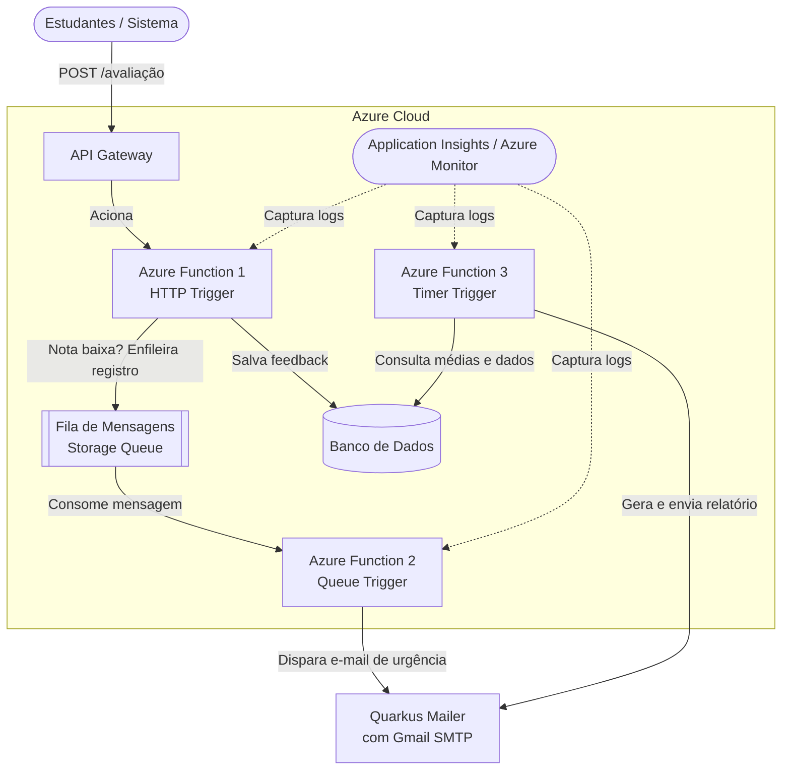

# ChefApi - Plataforma de Feedback e Avaliações

**ARQUITETURA E DESENVOLVIMENTO EM JAVA**
**FIAP - 10ADJT: Fase 4 - Serverless Strategist - Tech Challenge**
**Projeto: ChefApi - Grupo 32**

## 👥 Equipe


| Nome                            | RM       |
| ------------------------------- | -------- |
| João Gabriel da Silva Medeiros | RM368599 |
| Lucas Eduardo Correa de Souza   | RM367471 |
| Mateus Barbeiro Garcia          | RM368126 |
| Levi Santos                     | RM369031 |

---

## 📋 Índice

1. [Introdução](#introdução)
2. [Descrição do Problema](#descrição-do-problema)
3. [Objetivo](#objetivo)
4. [Requisitos](#requisitos)
5. [Arquitetura](#arquitetura)
6. [Tecnologias](#tecnologias)
7. [Estrutura do Projeto](#estrutura-do-projeto)
8. [Configuração](#configuração)
9. [Guia de Instalação](#guia-de-instalação)
10. [Deploy](#deploy)
11. [Monitoramento](#monitoramento)
12. [Segurança](#segurança)
13. [Documentação das Funções](#documentação-das-funções)

---

## 🎯 Introdução

O **ChefApi** é uma plataforma de feedback e avaliações desenvolvida como solução para a avaliação técnica da FIAP. O projeto implementa uma arquitetura serverless escalável hospedada no Microsoft Azure, permitindo que estudantes avaliem cursos e administradores acompanhem a satisfação dos alunos em tempo real.

A solução utiliza a plataforma cloud-native do Azure com funções serverless (Azure Functions) para automatizar o recebimento de feedbacks, o envio de notificações críticas e a geração de relatórios periódicos.

---

## 🔍 Descrição do Problema

Para garantir a qualidade dos cursos online, é essencial que os estudantes possam fornecer feedbacks estruturados e que os administradores possam acompanhar rapidamente a satisfação dos alunos. O sistema deve ser capaz de:

- **Receber feedbacks** de forma rápida e confiável
- **Enviar notificações** para itens críticos em tempo real
- **Gerar relatórios periódicos** para análise e tomada de decisão
- **Escalar automaticamente** conforme a demanda
- **Manter segurança** dos dados de clientes

---

## 🎓 Objetivo

Desenvolver uma aplicação hospedada em um ambiente de nuvem com funções serverless para:

✅ Automatizar o recebimento de feedbacks
✅ Disparar notificações imediatas para problemas críticos
✅ Gerar relatórios consolidados semanais
✅ Implementar segurança de dados em trânsito e em repouso
✅ Estabelecer governança de acesso com princípio do menor privilégio
✅ Manter a aplicação completamente monitorada

---

## 📋 Requisitos

### Obrigatórios

- ✅ Implementar serverless
- ✅ Rodar em ambiente cloud (Microsoft Azure)
- ✅ Mínimo 2 funções serverless com Responsabilidade Única
- ✅ Configurações de segurança para proteção de dados
- ✅ Deploy automatizado
- ✅ Aplicação monitorada

### Regras da Aplicação

- ✅ Separação de serviços e responsabilidades
- ✅ Notificações automáticas para problemas críticos
- ✅ Relatório semanal com média de avaliações
- ✅ Avaliação via HTTP POST em `/avaliação`

---

## 🏗️ Arquitetura

### Modelo de Cloud

A solução foi desenhada para operar em um modelo de computação em nuvem com foco em **Serverless (FaaS)**, utilizando o ecossistema do Microsoft Azure:



### Fluxo de Dados

1. **Ingestão**: Estudante submete avaliação via POST `/avaliação`
2. **Persistência**: Função salva feedback no PostgreSQL
3. **Triagem**: Se nota baixa, mensagem entra na fila
4. **Notificação**: Função de notificação consome fila e envia e-mail urgente
5. **Relatórios**: Timer dispara semanalmente agregando dados e enviando sumário
6. **Observabilidade**: Application Insights coleta logs e métricas de tudo

---

## 🛠️ Tecnologias

### Backend

- **Java 21** - Linguagem de programação
- **Quarkus 3.35.2** - Framework web/serverless otimizado
- **Jakarta EE** - Padrões de arquitetura Java

### Cloud & Serverless

- **Microsoft Azure** - Plataforma cloud
- **Azure Functions** - Compute serverless (FaaS)
- **Azure Storage Queue** - Mensageria assíncrona
- **Azure Database for PostgreSQL** - Banco de dados gerenciado
- **Azure Application Insights** - Observabilidade
- **Azure Monitor** - Monitoramento

### Ferramentas de Build & Deploy

- **Maven 3.x** - Gerenciador de dependências
- **GitHub Actions** - CI/CD automatizado
- **Docker** - Containerização

### Bibliotecas Principais

- **Jackson 2.15.2** - Serialização JSON
- **Hibernate ORM Panache** - Mapeamento objeto-relacional
- **PostgreSQL JDBC** - Driver banco de dados
- **Azure Functions Java Library** - SDK do Azure
- **Quarkus Mailer** - Envio de e-mails via SMTP

---

## 📁 Estrutura do Projeto

```
avaliacoes/
├── src/
│   ├── main/
│   │   ├── docker/           # Configurações Docker
│   │   ├── java/
│   │   │   └── org/
│   │   │       └── adjt/
│   │   │           ├── entities/        # Modelos JPA
│   │   │           ├── functions/       # Azure Functions
│   │   │           ├── services/        # Lógica de negócio
│   │   │           ├── dtos/            # Data Transfer Objects
│   │   │           └── config/          # Configurações
│   │   └── resources/
│   │       └── application.properties   # Configurações Quarkus
│   └── test/
│       └── java/                        # Testes unitários
├── target/                  # Artefatos compilados
├── pom.xml                 # Configuração Maven
├── mvnw / mvnw.cmd        # Maven Wrapper
├── local.settings.json     # Configurações locais (não versionado)
├── avaliacoes.iml         # Configuração IDE
└── README.md              # Este arquivo
```

---

## ⚙️ Configuração

### Variáveis de Ambiente Obrigatórias

```properties
# Banco de Dados PostgreSQL
DB_URL=jdbc:postgresql://host:port/database
DB_USER=postgres_user
DB_PASSWORD=secure_password

# Azure Storage (Queues)
AzureWebJobsStorage=DefaultEndpointsProtocol=https;...

# E-mail Gmail SMTP
EMAIL_USERNAME=seu-email@gmail.com
GMAIL_APP_PASSWORD=sua-senha-app-16-caracteres
EMAIL_FROM=seu-email@gmail.com
ADMIN_EMAIL=admin@seudominio.com

# Azure Monitor
APPLICATIONINSIGHTS_CONNECTION_STRING=...

# Azure Functions
AZURE_FUNCTION_APP_NAME=avaliacoes-func
AZURE_RESOURCE_GROUP=resource-group-east-us
```

### Arquivo `local.settings.json` (Local Development)

```json
{
  "IsEncrypted": false,
  "Values": {
    "AzureWebJobsStorage": "UseDevelopmentStorage=true",
    "FUNCTIONS_WORKER_RUNTIME": "java",
    "DB_URL": "jdbc:postgresql://localhost:5432/avaliacoes",
    "DB_USER": "postgres",
    "DB_PASSWORD": "root",
    "EMAIL_USERNAME": "seu-email@gmail.com",
    "GMAIL_APP_PASSWORD": "xxxx xxxx xxxx xxxx",
    "EMAIL_FROM": "seu-email@gmail.com",
    "ADMIN_EMAIL": "admin@example.com"
  }
}
```

> ⚠️ **IMPORTANTE**: `local.settings.json` deve ser adicionado ao `.gitignore` para nunca versioná-lo

### Arquivo `application.properties`

```properties
# Jackson
quarkus.jackson.write-dates-as-timestamps=false

# Azure Functions
quarkus.azure-functions.app-name=${AZURE_FUNCTION_APP_NAME:avaliacoes-func}
quarkus.azure-functions.resource-group=${AZURE_RESOURCE_GROUP:resource-group-east-us}

# Runtime
quarkus.azure-functions.runtime.os=linux
quarkus.azure-functions.runtime.java-version=21

# PostgreSQL
quarkus.datasource.db-kind=postgresql
quarkus.datasource.jdbc.url=${DB_URL}
quarkus.datasource.username=${DB_USER}
quarkus.datasource.password=${DB_PASSWORD}
quarkus.hibernate-orm.database.generation=update

# E-mail SMTP
quarkus.mailer.host=smtp.gmail.com
quarkus.mailer.port=587
quarkus.mailer.start-tls=REQUIRED
quarkus.mailer.username=${EMAIL_USERNAME}
quarkus.mailer.password=${GMAIL_APP_PASSWORD}
quarkus.mailer.from=${EMAIL_FROM}

# Admin
admin.email=${ADMIN_EMAIL}
```

---

## 🚀 Guia de Instalação

### Pré-requisitos

- **Java 21+** - [Download](https://www.oracle.com/java/technologies/downloads/)
- **Maven 3.8+** - [Download](https://maven.apache.org/download.cgi)
- **Git** - [Download](https://git-scm.com/)
- **Azure CLI** - [Download](https://docs.microsoft.com/pt-br/cli/azure/install-azure-cli)
- **PostgreSQL 14+** - [Download](https://www.postgresql.org/download/)
- **Azure Account** - [Sign Up](https://azure.microsoft.com/pt-br/free/)

### Setup Local

1. **Clone o repositório**

```bash
git clone https://github.com/seu-usuario/chefapi.git
cd avaliacoes
```

2. **Configure as variáveis de ambiente**

```bash
# Copie o arquivo de configuração
cp local.settings.json.example local.settings.json

# Edite com suas credenciais
notepad local.settings.json
```

3. **Instale as dependências Maven**

```bash
mvnw clean install
```

4. **Execute em modo desenvolvimento**

```bash
mvnw quarkus:dev
```

A aplicação estará disponível em `http://localhost:8080`

### Teste a API

```bash
# Submeter uma avaliação
curl -X POST http://localhost:8080/avaliacao \
  -H "Content-Type: application/json" \
  -d '{
    "estudante_id": "123",
    "disciplina": "Matemática",
    "nota": 8,
    "comentario": "Ótima aula"
  }'
```

---

## 📦 Deploy

### Automação via GitHub Actions

O projeto utiliza **GitHub Actions** para CI/CD automatizado. O workflow é acionado em cada push na branch `main`.

#### Configuração de Segredos (GitHub Secrets)

Adicione no repositório GitHub:

```
CLIENTID        # Client ID da Service Principal
SUBSCRIPTIONID  # Subscription ID do Azure
TENANTID        # Tenant ID do Azure
```

#### Workflow File

`.github/workflows/main_avaliacoes-tc-4.yml`

```yaml
name: Build and Deploy

on:
  push:
    branches: [main]
  workflow_dispatch:

env:
  AZURE_FUNCTIONAPP_NAME: avaliacoes-func
  AZURE_RESOURCE_GROUP: resource-group-east-us

jobs:
  build:
    runs-on: ubuntu-latest
    steps:
      - uses: actions/checkout@v4
    
      - name: Setup Java
        uses: actions/setup-java@v3
        with:
          java-version: '21'
          distribution: 'temurin'
    
      - name: Build with Maven
        run: mvn clean package -DskipTests
    
      - name: Login to Azure
        uses: azure/login@v1
        with:
          client-id: ${{ secrets.CLIENTID }}
          tenant-id: ${{ secrets.TENANTID }}
          subscription-id: ${{ secrets.SUBSCRIPTIONID }}
    
      - name: Deploy to Azure Functions
        uses: Azure/functions-action@v1
        with:
          app-name: ${{ env.AZURE_FUNCTIONAPP_NAME }}
          package: 'target/avaliacoes-1.0.0-SNAPSHOT-runner.jar'
          resource-group: ${{ env.AZURE_RESOURCE_GROUP }}
```

#### Deploy Manual (Azure CLI)

```bash
# Login no Azure
az login

# Deploy das funções
az functionapp deployment source config-zip \
  -g resource-group-east-us \
  -n avaliacoes-func \
  --src target/avaliacoes-1.0.0-SNAPSHOT-runner.jar
```

---

## 📊 Documentação das Funções

### 1. Função de Ingestão de Feedbacks

**Gatilho**: HTTP Trigger
**Rota**: `POST /avaliacao`
**Responsabilidade**: Receber, validar e persistir feedbacks

#### Request

```json
{
  "estudante_id": "string",
  "disciplina": "string",
  "nota": "integer (1-10)",
  "comentario": "string (opcional)"
}
```

#### Response (201)

```json
{
  "id": "uuid",
  "estudante_id": "string",
  "disciplina": "string",
  "nota": "integer",
  "comentario": "string",
  "data_criacao": "2024-05-31T10:30:00Z",
  "status": "processado"
}
```

#### Lógica

- Valida o payload
- Salva no PostgreSQL
- Se `nota < 5`: publica mensagem na fila de urgência
- Retorna 201 (Created) ou 400 (Bad Request)

---

### 2. Função de Notificação de Urgência

**Gatilho**: Queue Trigger
**Fila**: Azure Storage Queue
**Responsabilidade**: Enviar e-mails alertas para avaliações críticas

#### Evento (Message)

```json
{
  "avaliacao_id": "uuid",
  "estudante_id": "string",
  "nota": "integer",
  "disciplina": "string",
  "mensagem_urgencia": "Avaliação crítica detectada"
}
```

#### Ações

- Consome mensagem da fila
- Monta e-mail com dados da avaliação
- Envia para `admin.email` via SMTP Gmail
- Log de sucesso/erro no Application Insights

---

### 3. Função de Relatório Semanal

**Gatilho**: Timer Trigger
**Agendamento**: CRON `0 0 9 * * MON` (Segundas-feiras 09h UTC)
**Responsabilidade**: Gerar e enviar relatório consolidado

#### Dados Agregados

```json
{
  "periodo": "2024-05-27 a 2024-06-02",
  "total_avaliacoes": 150,
  "media_geral": 7.8,
  "distribuicao": {
    "criicas": 12,
    "atencao": 28,
    "satisfacao": 110
  },
  "top_disciplinas": [
    {"disciplina": "Matemática", "media": 8.2, "total": 50}
  ]
}
```

#### Saída

- E-mail HTML formatado
- Enviado para `admin.email`
- Logs capturados no Application Insights

---

## 🔐 Segurança

### Governança de Acesso (IAM)

A integração GitHub ↔ Azure usa **Identidade Gerenciada** com **Credenciais Federadas (OIDC)**:

- ✅ Sem senhas estáticas
- ✅ Acesso restrito à branch `main`
- ✅ Princípio do Menor Privilégio

### Gestão de Segredos


| Ambiente  | Armazenamento         | Status                          |
| --------- | --------------------- | ------------------------------- |
| **Local** | `local.settings.json` | ❌ Não versionado (.gitignore) |
| **Cloud** | App Settings (Azure)  | ✅ Versionado, acesso restrito  |

### Segurança de Dados

- **Em Trânsito**: HTTPS obrigatório (TLS 1.2+)
- **Em Repouso**: Criptografia nativa do Azure PostgreSQL
- **Acesso BD**: Firewall + whitelist de IPs + acesso restrito ao Azure

### Conformidade

- ✅ Dados do cliente protegidos
- ✅ Auditoria completa via Application Insights
- ✅ Conformidade com regulações de privacidade

---

## 📈 Monitoramento

### Application Insights

Todos os logs e métricas são centralizados no **Azure Application Insights**:

```

| Métrica | Descrição |
|---------|-----------|
| **Success Rate** | Taxa de sucesso das funções |
| **Response Time** | Tempo médio de resposta |
| **Errors** | Taxa de falhas e tipos de erro |
| **Request Volume** | Número de requisições por minuto |
| **Custom Events** | Eventos de negócio relevantes |

#### Acessar Métricas

1. Azure Portal → Resource Group → Application Insights
2. Abas úteis:
   - **Live Metrics**: Fluxo em tempo real
   - **Application Map**: Dependências entre componentes
   - **Performance**: Análise de latência
   - **Failures**: Rastreamento de erros
   - **Logs**: Consultas custom (KQL)

#### Query Exemplo (KQL)

```kusto
requests
| where timestamp > ago(1d)
| where url contains "avaliacao"
| summarize count() by resultCode
```

---

## 🧪 Testes

### Teste Unitário

```bash
mvnw test
```

### Teste de Integração

```bash
mvnw verify
```

### Teste Manual (cURL)

```bash
# 1. Submeter avaliação
curl -X POST http://localhost:8080/avaliacao \
  -H "Content-Type: application/json" \
  -d '{"estudante_id":"E001","disciplina":"Quarkus","nota":8,"comentario":"Excelente"}'

# 2. Submeter avaliação crítica
curl -X POST http://localhost:8080/avaliacao \
  -H "Content-Type: application/json" \
  -d '{"estudante_id":"E002","disciplina":"Azure","nota":2,"comentario":"Confuso"}'

# 3. Verificar logs localmente
# Verifique a fila de mensagens e os e-mails enviados
```

---

## 📝 Qualidade de Código

### Princípios Aplicados

1. **SOLID - SRP (Responsabilidade Única)**

   - Cada função serverless tem um escopo bem definido
   - Separação clara entre funções de ingestão, notificação e relatórios
2. **Clean Code**

   - Nomes significativos
   - Métodos pequenos e focados
   - Documentação clara
3. **DTO Pattern**

   - Serialização/desserialização eficiente
   - Formato ISO-8601 para datas (Jackson)
4. **Injeção de Dependências**

   - Uso intensivo de `@Inject` (Quarkus CDI)
   - Facilita testes e manutenção
5. **Sem Hardcode**

   - Todas as credenciais via variáveis de ambiente
   - Configurações centralizadas em `application.properties`

---

## 🤝 Contribuindo

1. Faça um fork do repositório
2. Crie uma branch para sua feature (`git checkout -b feature/nova-feature`)
3. Commit suas mudanças (`git commit -am 'Adiciona nova feature'`)
4. Push para a branch (`git push origin feature/nova-feature`)
5. Abra um Pull Request

---

## 📞 Suporte

Para dúvidas ou problemas:

- Abra uma **Issue** no GitHub
- Consulte a [Documentação Quarkus](https://quarkus.io)
- Veja [Docs Azure Functions](https://learn.microsoft.com/pt-br/azure/azure-functions/)

---

## 📄 Licença

Este projeto é fornecido como parte da avaliação técnica FIAP.

---

## 🔗 Referências

- [Quarkus Framework](https://quarkus.io)
- [Azure Functions Documentation](https://docs.microsoft.com/pt-br/azure/azure-functions/)
- [Azure PostgreSQL](https://docs.microsoft.com/pt-br/azure/postgresql/flexible-server/)
- [Application Insights](https://docs.microsoft.com/pt-br/azure/azure-monitor/app/app-insights-overview)
- [Java 21 Features](https://www.oracle.com/java/technologies/javase/jdk21-doc/)

---

**Última atualização**: Maio 2024
**Status**: ✅ Em Produção
